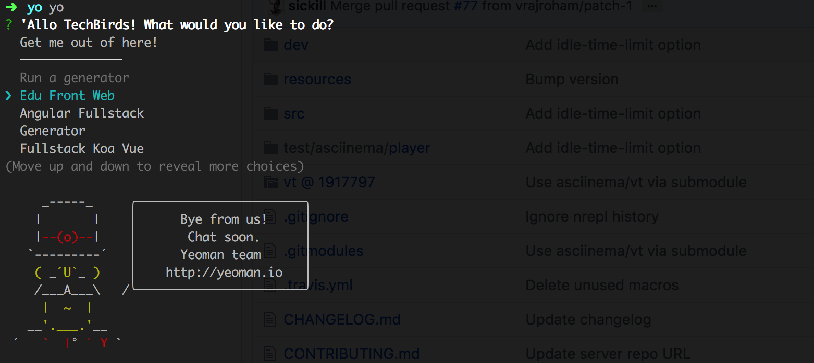

# Edu-Front-Web :dog:

> 基于对云课堂、中国慕课、爱多思以及通用组件池等的前端架构和设计理念的理解和实践希望沉淀出一套足够通用、简约、易于上手的教育前端Web工程脚手架。

## 安装

``` bash
npm install "techbirds/nei-toolkit#edu-fmpp" -g
npm install -g yo
npm install -g generator-edu-front-web
```

## 工程目录

```
├── deploy
├── doc
├── res
├── src
│   ├── lib
│   └── pages
│       ├── demo1       # Regular Module 
│       └── demo2       # NEJ Module
├── template
│   ├── demo1.ftl
│   ├── demo2.ftl
│   └── index.ftl
└── test
├── .bowerrc
├── .gitignore
├── .editorconfig
├── .eslintrc.json
├── nei.config.js
├── gulpfile.js
├── bower.json
├── package.json
├── README.md
```

## 使用

<a href="https://asciinema.org/a/VEUpB9cm1NB9muUItnfNgGUlT" target="_blank">terminal demo</a>



## 开发

```bash

# 1. 开发 & 实时编译
npm run dev

# 2. 打包
npm run deploy

```

## FAQ

* [Edu Awesome](https://github.com/techbirds/edu-awesome)
* [加速electron在国内的下载速度](http://blog.tomyail.com/install-electron-slow-in-china/)

