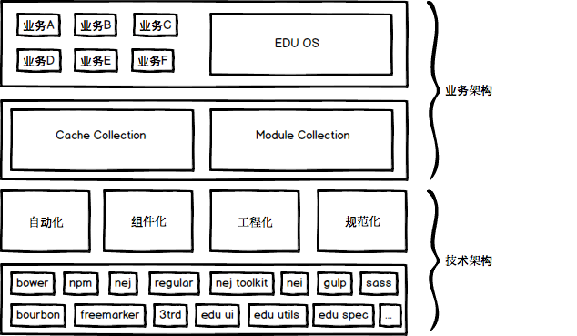

# Edu-Front-Web :dog:

> 基于对云课堂、中国慕课、爱多思以及通用组件池等的前端架构和设计理念的理解和实践希望沉淀出一套足够通用、简约、易于上手的前端工程脚手架。

## 技术架构



### 工程目录

```
├── deploy
├── doc
├── res
├── src
│   ├── lib
│   └── pages
│       ├── demo1       # Regular Module 
│       └── demo2       # NEJ Module
├── template
│   ├── demo1.ftl
│   ├── demo2.ftl
│   └── index.ftl
└── test
├── edupack.conf
├── gulpfile.js
├── nei.config.js
├── package.json
├── .bowerrc
├── bower.json
├── .gitignore
├── README.md
```

### 核心技术栈

* [NEJ](https://github.com/genify/nej)
    * [NEJ API](http://nej.netease.com/help/index.html)
    * [NEJ Plugin For Intellij](https://github.com/techbirds/NEJPlugin)
    * [NEJ Plugin For VSCode](https://github.com/techbirds/vscode-edu-module-peek)
* [NEJ Toolkit](https://github.com/genify/toolkit2)
* [Regular](https://github.com/regularjs/regular)
    * [Regular Guide](http://regularjs.github.io/guide/zh/index.html)
    * [Regular API](http://regularjs.github.io/reference/?syntax-en)
    * [Regular Developer Tools](https://chrome.google.com/webstore/detail/regular-developer-tools/ehlcoecgkhfjffhmdhmhbjkjjpaecmam)
* Edu UI
* Edu Spec
* [NEI](https://github.com/techbirds/nei-toolkit/tree/edu-fmpp)  
    * [Edu Project](https://nei.netease.com/project/res/?pid=24848)
    * [Edu Project Spec](https://nei.netease.com/spec/detail/?id=13980)
* [SASS](http://sass.bootcss.com/docs/sass-reference/)

## 环境

``` bash
npm install "techbirds/nei-toolkit#edu-fmpp" -g # nei install
```

## 使用

```bash
# 1. npm & bower install
npm run init

# 2. 开发 & 实时编译
npm start

# 3. 打包
npm run deploy
```


